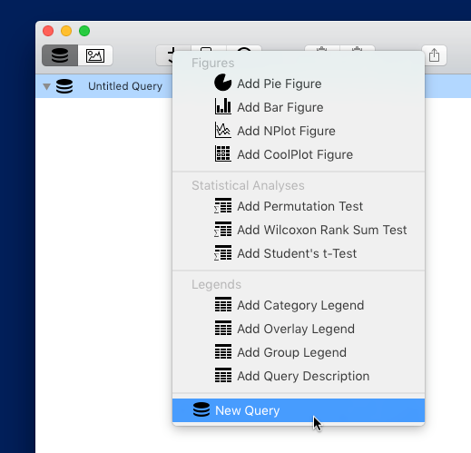

## Managing Query Groups

Query groups are at the heart of SPICE. Through a query group you can specify the exact structure of your data query and keep together figures that share this query. You can have as many query groups in a document as you need, which helps you quickly switch between different "views" into your data for easy discovery and publication.

While in Outline View mode, you can add, duplicate, or delete query groups (and figures to/from selected query groups) using the above asset control in the toolbar. 

### Adding

Clicking the **+** button presents you with a menu as shown below.

Select New Query to add a new query group to the outline and is selected, ready to edit.

### Duplicating

To duplicate a query group (and all its figures if it has any), select the query group in the outline and press the duplicate button (the middle button in the asset control in the toolbar). The duplicate will be added and selected in the outline.

### Deleting

To delete a query group (and all its figures if it has any), select the query group in the outline and press the delete button (the rightmost button in the asset control in the toolbar). The query group will be removed.

### Renaming

To rename a query group, select it in the outline and click the name. A name field will appear. Type the new name and press return to change it or press escape to cancel. You *must* first select the query group before you can click the name to rename it.

### Undo

Each of the above actions is undoable.

### Exporting

A query group's result data can be exported as a tab-separated text table by dragging the query group from the outline into a Finder folder or onto the Desktop. You can also choose Copy Result Table from the Query menu in the main menu bar, which places the tab-separated text table onto the pasteboard for pasting into a text editor, Excel, JMP, or any number of applications that accept this type of paste.

*****

[Return to Guide Index](guide) | [Previous](guide-importing) | [Next](guide-querystructurecontrols)
